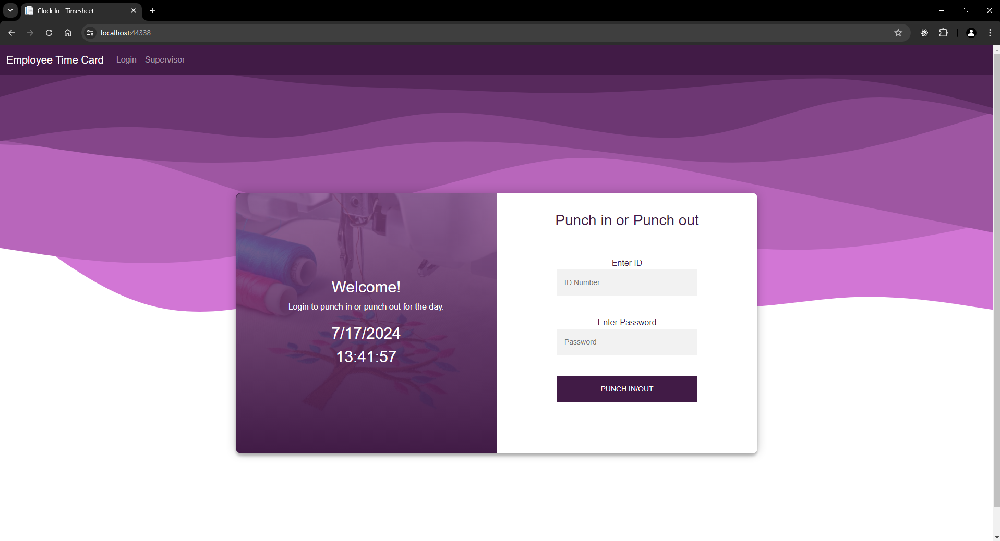
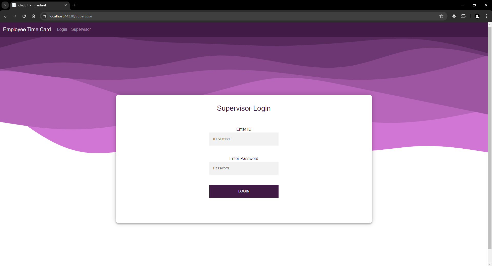

# Timesheet web application
Project that allows staff to clock in and out for the day.

## Employee Clock In/Out and Supervisor Login
 

## Reason for this project
This project was made for a small business in mind. The staff would be less than 10 employess working for a small shop. Clocking in and clocking out for this business was done on paper which is why the owner just wanted a simple way for them to clock in and out. 

## How is the project strucutred
This web application has two navigation options. One for employees to clock in and out, and another for a supervisor to login. For this reason, I believed that using an MVC framework would be a great option to 
* An employee requires a unique employee id and a password. 
* A supervisor is able to login and is able to edit and delete an employee's shift. 

## Tech used
ASP.NET Core 8, Visual Studio 2022 
Languages: C#, SQL, HTML, CSS

## Lessons learned
* Better understanding of an MVC framework and how each component works together.
